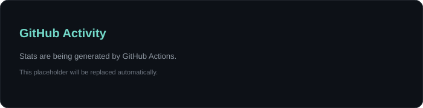
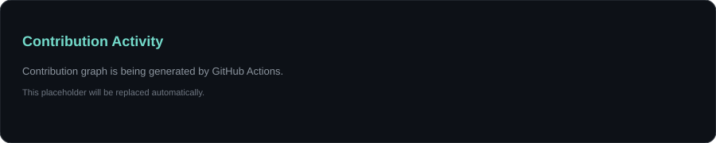

  
  

   

  

   

  

 

### Featured Projects

<table>
  <tr>
    <td width="50%" valign="top">
      <h3><a href="https://github.com/aproto9787/codex-bridge">codex-bridge</a></h3>
      
Bridge to run Codex CLI as a Claude Code native teammate — multi-model agent orchestration for AI-powered development.

      
<code>JavaScript</code> · <code>Claude Code</code> · <code>Codex</code> · <code>Multi-Agent</code>

    </td>
    <td width="50%" valign="top">
      <h3><a href="https://github.com/aproto9787/EGTSR">EGTSR</a></h3>
      
Execution-Grounded Task-State Runtime — obligation tracking, stale quarantine, and resume safety plugin for Claude Code.

      
<code>Python</code> · <code>Claude Code</code> · <code>Agent Runtime</code>

    </td>
  </tr>
</table>

 

### GitHub Stats

  

 

  

 

Stats are generated inside this repository by GitHub Actions and committed as SVG files. No personal Vercel deployment is required.

  

  

